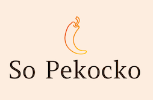

# 

Construire une API sécurisée pour une application d'avis gastronomiques.:fork_and_knife:

## Sommaire

1.[INTRODUCTION](#introduction)  
2.[INSTALLATION](#installation)  
3.[REALISATION DE L API](#realisation-de-l-api)  
4.[TECHNOLOGIES UTILISEES](#technologies-utilisees)  
5.[COMPETENCES EVALUEES](#competences-evaluees)  
6.[CONTACT](#contact)

## INTRODUCTION

[So Pekocko](https://fredtams79.github.io/FredTamarelle_6_01072021/) est une entreprise familiale de 10 salariés.
Son activité principale est la création de **sauces piquantes** dont la composition est tenue secrète.:wink:  
L'entreprise souhaite se développer et créer une application web, dans laquelle les **utilisateurs pourront ajouter leurs sauces préférées et liker ou disliker** les sauces proposées par les autres.

[MVP du projet](https://s3.eu-west-1.amazonaws.com/course.oc-static.com/projects/DWJ_FR_P6/P6_Note%20de%20cadrage%20So%20Pekocko_V3.pdf)

## INSTALLATION

### Prérequis

Pour faire fonctionner le projet, vous devez installer :

- [NodeJS](https://nodejs.org/en/download/) en version 12.14 ou 14.0
- [Angular CLI](https://github.com/angular/angular-cli) en version 7.0.2.
- [node-sass](https://www.npmjs.com/package/node-sass) : attention à prendre la version correspondante à NodeJS. Pour Node 14.0 par exemple, installer node-sass en version 4.14+.

Sur Windows, ces installations nécessitent d'utiliser PowerShell en tant qu'administrateur.

### Installation

#### :computer:Partie Front-End

- La partie **Front-End** se trouve dans le dossier _FrontEnd_ (sous-module) ,
- OU téléchargez la partie front-end de l'application :
  - `git clone https://github.com/OpenClassrooms-Student-Center/dwj-projet6`
- Installez les librairies nécessaires pour faire fonctionner le serveur front-end :
  - `npm install`
  - `npm install -g @angular/cli@7.0.2`
  - `npm install node-sass@4.14`
- Lancez le serveur :
  - `npm start` ou `ng serve`
- Rendez-vous sur :
  - `http://localhost:4200/`
  - pour la création d'un compte il vous faudra un **mot de passe** qui devra contenir au minimum 6 caractères dont :  
    _2 chiffres, 1 minuscule, 1 symbole et sans espace_.

#### :office:Partie Back-End

- La partie **Back-End** se trouve dans le dossier _BackEnd_,
- Téléchargez la partie back-end de l'application :
  - `git clone https://github.com/lifeae/OC_WD_P6 backend`
- Installez les librairies nécessaires pour faire fonctionner le serveur back-end :
  - `npm install`
  - Mongoose - Bcrypt - Body-Parser - Express - jsonwebtoken - Multer - mongoose-unique-validator - Nodemon - ...
- Pensez à remplacer les noms de variables par vos données de MongoDB dans le fichier ".envExemple"
- Lancez le serveur
  - `node server` ou `nodemon server`
- Rendez-vous sur :
  - `http://localhost:3000`

## REALISATION DE L API

- l’API doit respecter le RGPD et les standards OWASP ;
- le mot de passe des utilisateurs doit être chiffré ;
- 2 types de droits administrateur à la base de données doivent être définis :  
  un accès pour supprimer ou modifier des tables, et un accès pour éditer le contenu de la base de données ;
- la sécurité de la base de données MongoDB (à partir d’un service tel que MongoDB Atlas)  
  doit être faite de telle sorte que le validateur puisse lancer l’application depuis sa machine ;
- l’authentification est renforcée sur les routes requises ;
- les mots de passe sont stockés de manière sécurisée ;
- les adresses mails de la base de données sont uniques et un plugin Mongoose approprié est utilisé pour s’assurer de leur caractère unique et rapporter des erreurs.

## TECHNOLOGIES UTILISEES

- Framework : **Express**,
- Serveur : **NodeJS**,
- Base de données **MongoDB**,
- Toutes les bases de données doivent utiliser le pack **Mongoose** avec des schémas de données stricts.

### Informations complémentaires

> Le nombre de likes/dislikes et les tableaux like/dislike doivent être mis à jour pour mettre en œuvre la fonctionnalité.

## COMPETENCES EVALUEES

- Implémenter un modèle logique de données conformément à la réglementation ;
- Mettre en œuvre des opérations CRUD de manière sécurisée ;
- Stocker des données de manière sécurisée.

## CONTACT

[So Pekocko](https://github.com/FredTams79) :smiley:

> Ce site a été réalisé dans le cadre du projet 6 de la formation Développeur Web
> d'[Openclassrooms](https://openclassrooms.com/fr/paths/185-developpeur-web).
